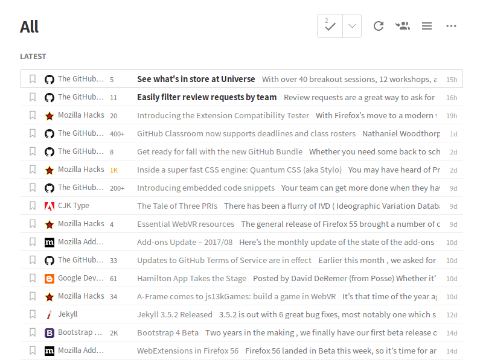

# Feedly Faviconize List

A user script to show feed favicons in Feedly Title-Only View.

## Screenshot

## Installation

Install the user script from [Greasy Fork](https://greasyfork.org/):
https://greasyfork.org/ja/scripts/31076-feedly-faviconize-list

## License

Licensed under the [MIT License](LICENSE.md).
